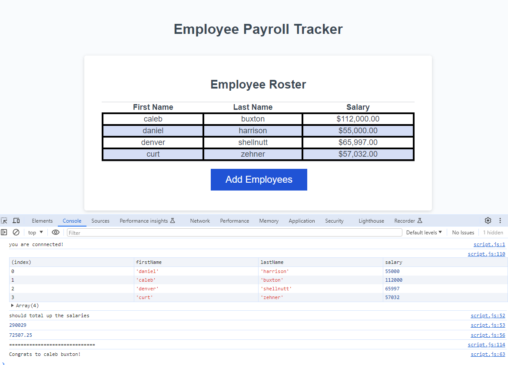

# Payroll Tracker

# dmh_professional_portfolio

## Description

Tasked with modifying starter code to create an application that enables a payroll manager to view and manage employee payroll data. This app will run in the browser and will feature dynamically updated HTML and CSS powered by JavaScript code that you write. It will have a clean and polished, responsive user interface that adapts to multiple screen sizes.

  

## Acceptance Criteria

- GIVEN an employee payroll tracker
  WHEN I click the "Add employee" button
  THEN I am presented with a series of prompts asking for first name, last name, and salary
  WHEN I finish adding an employee
  THEN I am prompted to continue or cancel
  WHEN I choose to continue
  THEN I am prompted to add a new employee
  WHEN I choose to cancel
  THEN my employee data is displayed on the page sorted alphabetically by last name, and the console shows computed and aggregated data

## Deployed Site Link

[GitHub Pages] https://dmharrison.github.io/dmh_professional_portfolio/

## License

MIT
